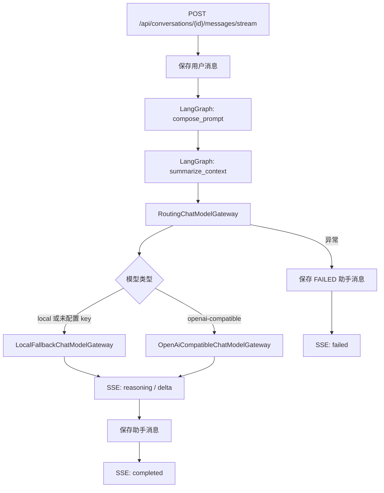

# Python LangGraph 后端

这是智能对话助手的 Python 后端实现，独立放在 `python-backend/`，不影响当前 Java 后端。

## 技术选型

| 能力 | 实现 |
| --- | --- |
| Web 框架 | FastAPI |
| 对话编排 | LangGraph |
| 流式输出 | SSE `text/event-stream` |
| 数据库 | openGauss，使用 PostgreSQL 协议连接 |
| 模型接入 | OpenAI-compatible HTTP 流式接口，本地回退模型 |
| 文件导出 | Markdown / XLSX |

## 启动

要求 Python 3.11 及以上版本。

```bash
cd python-backend
python3.11 -m venv .venv
source .venv/bin/activate
pip install -e ".[test]"
cp .env.example .env
uvicorn app.main:app --host 0.0.0.0 --port 8090 --reload
```

如果本机默认 `python3` 已经是 3.11 及以上，也可以使用 `python3 -m venv .venv`。

数据库沿用根目录的 openGauss：

```bash
cd ..
docker-compose up -d
```

## 前端切换

将 Vite 代理或环境变量切到 Python 后端：

```bash
VITE_API_BASE_URL=http://127.0.0.1:8090 npm run dev
```

接口路径保持兼容：

- `GET /api/conversations`
- `POST /api/conversations`
- `DELETE /api/conversations/{conversationId}`
- `GET /api/conversations/{conversationId}/messages`
- `DELETE /api/conversations/{conversationId}/messages`
- `POST /api/conversations/{conversationId}/messages/stream`
- `GET /api/skills`
- `POST /api/skills/extractions`
- `GET /api/models`
- `POST /api/files`
- `POST /api/exports/markdown`
- `POST /api/exports/excel`

## LangGraph 流程



## 测试

```bash
pytest
```
